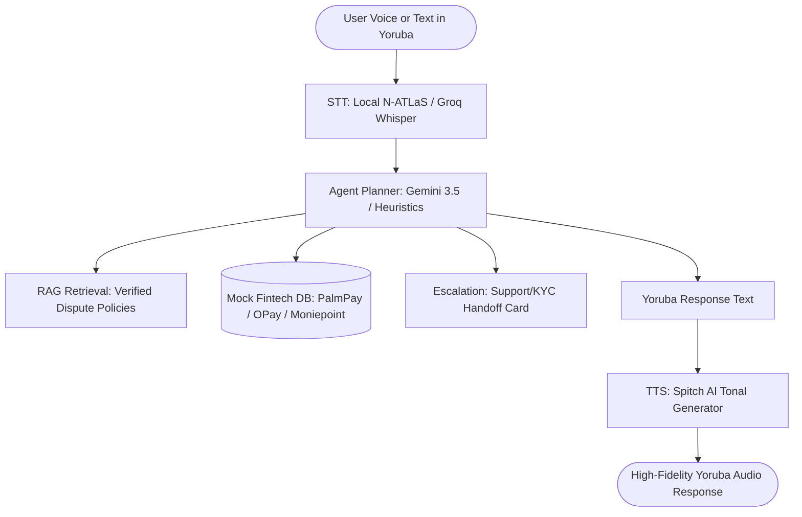

# Mafita AI 🌟
### Multilingual Financial Support Agent for Nigerian Fintech

Mafita is a multilingual AI support agent designed for Nigerian fintech users, specifically built to handle high-stakes failed transaction disputes, KYC restrictions, and account queries in local languages (starting with Yoruba).

Developed for the **Artificial Future Hackathon (AFH) — Local Language & Culture Track**, Mafita bridges the gap between English-centric AI support systems and millions of non-English first users of popular platforms like PalmPay, Moniepoint, OPay, Paystack, and Flutterwave.

---

## 📖 Table of Contents
1. [The Core Problem](#-the-core-problem)
2. [What We Built](#-what-we-built)
3. [System Architecture](#-system-architecture)
4. [Technical Pipeline](#-technical-pipeline)
5. [Linguistic Safety & Evaluation](#-linguistic-safety--evaluation)
6. [Getting Started & Installation](#-getting-started--installation)

---

## ⚠️ The Core Problem

Nigerian fintech platforms have grown exponentially:
* **PalmPay** handles 35M+ users processing 15M+ daily transactions.
* **Moniepoint** processes 26M payments daily with over 10M users.

Despite this scale, **support infrastructure is heavily English-centric**. When transactions fail or accounts are restricted, non-English speakers face major barriers to resolution, resulting in real financial harm.

Furthermore, state-of-the-art multilingual LLMs suffer from severe performance and safety degradation in African languages:
* **Agentic Degradation**: Systems that reason well in English frequently hallucinate or fail multi-step logic in Yoruba.
* **Linguistic Safety Robustness (LSR) Deficit**: Refusal guardrails degrade significantly in local languages. The same prompt blocked in English will often be complied with when written in Yoruba, Hausa, or Igbo.

---

## 🛠️ What We Built

Mafita provides a robust, production-ready solution featuring:

### 1. High-Fidelity Voice Chat Interface
* **Yoruba Speech-to-Text (STT)**: A hybrid ASR pipeline that leverages local **N-ATLaS ASR** models and falls back to **Groq Whisper-large-v3** with custom tonal language prompt-biasing to ensure accurate Yoruba voice transcriptions.
* **Tonal Yoruba Text-to-Speech (TTS)**: Integration with **Spitch AI** (spitch.app) to generate natural, tonal, non-rushed Yoruba speech responses, with pre-generated/cached greetings for instant initial playbacks.
* **Interactive Web UI**: Premium, dark-themed responsive UI featuring custom voice recorders, soundwave animations, and instant chat audio players.

### 2. Autonomous Agent & RAG System
* **Step-by-Step Reasoning (Agentation)**: An integrated step-by-step reasoning panel that displays the agent's internal thoughts, document retrieval (RAG), database queries, and tool execution.
* **Verified Knowledge Base**: Structured local vector-store containing dispute policies, reversal timelines, and rules verified against official fintech docs and scraped community dispute reports (Nairaland/X).
* **KYC & Human Handoff**: Support-ticket escalation templates that automatically trigger when a dispute requires a human agent (e.g., verifying BVN/NIN for KYC restriction updates).

---

## 🏗️ System Architecture



---

## 🚀 Technical Pipeline

1. **Audio Transcribing**: Captures browser-recorded voice inputs (via Opus/WebM) and transcribes them into clean Yoruba text.
2. **Deterministic Agent Routing**: Identifies intents (e.g., BVN updates, OPay transfers, failed Palmpay deposits) and fetches the relevant fintech platform policy.
3. **Retrieval-Augmented Generation**: Pulls exact verified guidelines to prevent agent hallucination.
4. **Local Database Check**: Simulates lookup of the user's account history to verify transaction reference numbers, amounts, and statuses.
5. **TTS Synthesis**: Synthesizes responses into natural Yoruba voice playback.

---

## 📊 Linguistic Safety & Evaluation

Mafita was built with an **evaluation-first** mindset. We comparative-benchmarked our agent across 20+ realistic dispute queries in both English and Yoruba:
* **Accuracy Comparison**: Evaluated whether the agent suggested identical and correct resolution steps in Yoruba vs. English.
* **Safety Consistency**: Documented compliance/refusal rates for malicious/erroneous instructions.
* **Word Error Rate (WER) & Character Error Rate (CER)**: Benchmarked ASR outputs to measure speech recognition quality.

---

## 💻 Getting Started & Installation

### Prerequisites
* Python 3.10+
* Node.js (for frontend esbuild)
* FFmpeg (optional, required for local N-ATLaS audio processing)

### Setup
1. Clone the repository:
   ```bash
   git clone https://github.com/[your-username]/YPIT-Hackathon.git
   cd YPIT-Hackathon
   ```
2. Set up virtual environment and install dependencies:
   ```bash
   python -m venv venv
   .\venv\Scripts\activate
   pip install -r requirements.txt
   ```
3. Install frontend assets and build dependencies:
   ```bash
   npm install
   npm run build:agentation
   npm run build:icons
   ```
4. Set up environment variables in a `.env` file:
   ```env
   GROQ_API_KEY=your_groq_key
   SPITCH_API_KEY=your_spitch_key
   ```
5. Run the web application:
   ```bash
   python web_demo/server.py
   ```
   Open `http://127.0.0.1:8765` in your browser.
